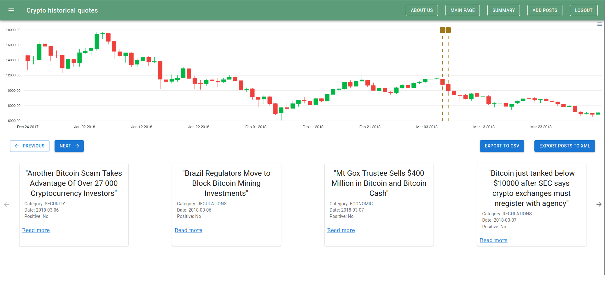

# Crypto Data Analysis

## What is it actually? Quick explanation

The main function of this platform is to get and store data associated with crypto currencies. The application provides the daily data about chosen currencies and enables analysis of this data including dependencies between crypto currency and factors like: statements of famous people, COVID pandemic and another important situations in the last years.
The aim of the project was to create a web application that demonstrates the impact of events related to the cryptocurrency world on their value. The application's goal was to correlate articles (divided into various categories) concerning selected cryptocurrencies: Bitcoin, Ethereum, Litecoin with their prices over a specific period. The conclusion drawn from the data analysis is the type of impact events (negative, positive) have on the specific cryptocurrency prices within the chosen time frame.

## Sources of used data

The data used for the proper functioning of the application was downloaded from https://www.kaggle.com/.

Historical cryptocurrency prices:

- https://www.kaggle.com/datasets/sudalairajkumar/cryptocurrencypricehistory
- https://www.kaggle.com/datasets/kapturovalexander/bitcoin-and-ethereum-prices-from-start-to-2023
- https://www.kaggle.com/datasets/kapturovalexander/bitcoin-and-other-14-most-significant-cryptos?select=13+Litecoin.csv

Articles: 
- https://www.kaggle.com/datasets/aaroncbastian/crypto-news-headlines-and-market-prices-by-date

In the article dataset, only the headlines and their dates were provided. To find links to the selected, most important articles, we copied the chosen headlines into a browser to locate the specific article online. We then analyzed the impact of the article, classifying whether the event described in the article had a positive or negative influence on the cryptocurrency's value. Additionally, we assigned a specific category to each article.

We primarily focused on articles/events related to Bitcoin, as there was a vast selection of various events, and Bitcoin is by far the most popular cryptocurrency. Regarding Ethereum and Litecoin, fewer articles were selected; their number is mainly illustrative to demonstrate the application's functionality. The site administrator can add articles via the web application, and additionally, a larger number of articles can be added simultaneously using a tool like Postman.

## Running the application locally
To run the application locally, you first need to load the database backup into a MySQL database. This can be done using the following command:

```bash
mysql -u username -p database_name < backup.sql
```
where:
- username: The username of the user account (In the backend part of the application, it is named testUser123, so it needs to exist on the MySQL server. Alternatively, you may need to change the username field in the application.yaml file.),
- database_name: The name of the database (We are using a default database named cryptoData.).

After running the command, you need to provide the user's password (in the application.yaml file, the password is "haslo123", which you can adjust according to your own needs).

Once the database is configured, you can easily run the backend part of the application. We did this in IntelliJ IDEA (version 2023.3.5 Community Edition).

To run the frontend part, while in the "frontend" directory, you need to enter the command 

```bash
npm install
```
and then
```bash
npm run dev
```
which will start the application on port 5173.

Another way to use the application is by building the images and then running the containers.
## Building images
To build images for the database, backend, and frontend parts of the application, you should use the command:
```bash
docker compose build
```

## Running containers

To start containers based on the created images, you should use the command:
```bash
docker compose up
```
Note: In order for the containers to be started, the following ports on the system must be available: 3306, 5173, 8080.

## Using the application

To access the application in a web browser, you should enter http://localhost:5173 into the address bar.

For the application, there is one administrator account created:
- e-mail address: admin@admin.com
- password: Admin123,

## List of used technologies and their versions:

- MySQL: 8.0.36-0ubuntu0.22.04.1
- Postman: v10.24
- Java: 17
- Spring Boot: 3.1.11
- JWT Tokens
- Hibernate: 7.0.2.Final
- Jackson: 2.13.4
- Maven: 3.6.3
- JavaScript: v16.20.2
- Node.js: v16.20.2
- React: ^18.2.0
- Material UI: ^5.15.18
- ApexCharts.js: ^3.49.1
- Axios: ^0.24.0
- Vite: ^4.5.3

## Example of a running project


